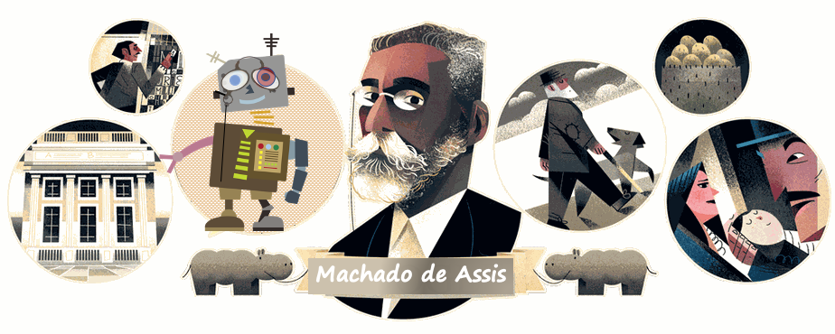

# Machado de Assis Bot
Portuguese Text Generation with Artificial Neural Networks

- Project developed by Marcelo Rovai, based on lessons learned with the great teacher [José Portilla](https://www.udemy.com/course/complete-tensorflow-2-and-keras-deep-learning-bootcamp/#instructor-1) during his fantastic course: [Complete Tensorflow 2 and Keras Deep Learning Bootcamp](https://www.udemy.com/course/complete-tensorflow-2-and-keras-deep-learning-bootcamp/#instructor-1)
- The Artificial network developed on this project, generates text, character by character. Please see this following site, for a great general visual explanation: [The Unreasonable Effectiveness of Recurrent Neural Networks](http://karpathy.github.io/2015/05/21/rnn-effectiveness/) and also check the [TF site for details](https://github.com/tensorflow/docs/blob/master/site/en/tutorials/text/text_generation.ipynb). 

## Introduction
What would happen if a robot learned from the great Machado de Assis and started to write short stories? I said learn, not plagiarize or copy random excerpts!

The writer robot (an Artificial Intelligence), is a Recurrent Neural network (RNN - GRU) of 3 levels, with 1,207 neurons (64 - 1,026 - 117). A total of 3.5 million parameters have been trained repeatedly 30 times (Epochs), to obtain the final AI model. I trained the model using Python / Tensorflow2.0 / Keras

Ah! Most importantly, the training was based on seven original Machado books downloaded from the Gutenberg Project:

- Memorias Posthumas de Braz Cubas,
- Dom Casmurro,
- Quincas Borba,
- Papeis Avulsos,
- A Mao e a Luva,
- Esau e Jacob,
- Memorial de Ayres

From the corpus formed by these seven books, the model was trained with 2.5 million characters as input, separated into groups of 120 characters (more or less an average paragraph size).

Note that the model can create names with capital letters, start paragraphs with capital letters, and end with punctuation. Create chapters, dialogs, etc. I couldn't say if all the characters are real (I didn't check), but the robot likely could have invented some.
The model is simple, so, logically, when reading the text, it is cleared observed that it has no sense, but surely it has the "sent of Machado" ;-)

It would be something like this ...

#### A LUVA DE CASMURRO II
A missa do _coupé_ e um presente e o governo devia cazar logo no papel, a morte do autor, e todos os seus considerados de alegria. Era um espirito de vinte e cinco annos, e eu não estou alguns passos no cerebro, como de outra cousa. Deus me disse:

--Não digo que não. Se eu tivesse a intenção de um probosito. Palha acudiu a mulher, não havia nada. A noite vinha tambem para o seminario, tinha o aspecto do partido recto e de restaurar a minha mãe e do pae, pela primeira vez, a menor destinada a dispensar o chapéo, esperou que não vinhas com as suas mãos de creanças. A manhã della chegasse a baroneza e a maneira desta divida. Parece que é casada.

--Está bom, perdoa-lhe de todos os lados, a vida de que o comprar para o meu quarto de hora, e contavam com o fim de a anterior, e, a parede pouco tempo a alma de pessoas que definitivamente lhe interessam a menos para mim. De quando em quando, esses dous annos de conversação para o fim de deixar nenhuma pessoa que se dispersasse; mas não falo de uma cousa nem lhe pedia com a mão tremula, como se ella quizesse. Eu, apertando-lhe a mão, aliás o principio do governo, a proposito disso, com a desattenção de Estevão, e eu começou a aborrecel-o, e a solidão podia ser melhor, e a sympathia colloca da mãe, e não se sabe calar o enterro no meio do lagem, o que iam-se apanhados no chão, e para a mulher, não tendo visto, nem a mesma cousa.

...
